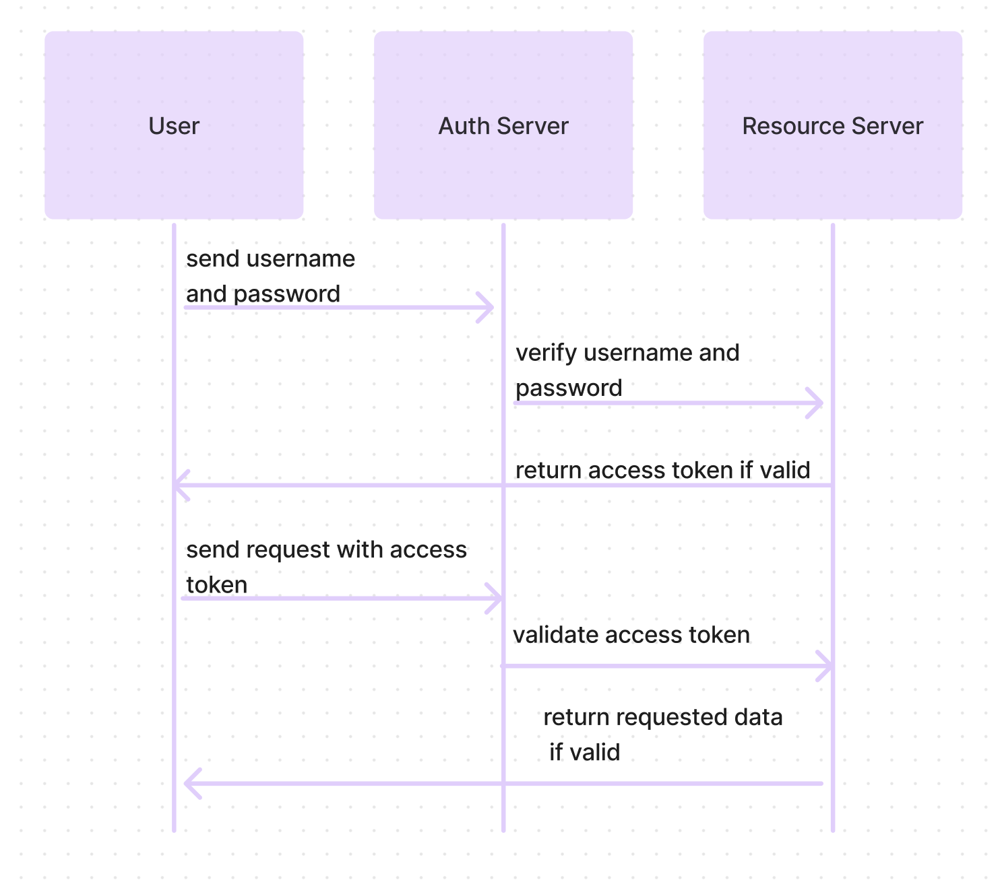

# LAB - Class 34 - API Integration

3/30/23 

- added Todo model and routes to existing model and routes. 
- NEXT: redeploy & connect to todo app

# LAB - Class 08

## Project: Access Control

### Author: Ezgi Coban

### Links and Resources

- [ci/cd](https://github.com/ezgi-c/auth-api/actions) (GitHub Actions)
- [back-end server url](https://auth-api-2.onrender.com/) 
<!-- - [front-end application](http://xyz.com) (when applicable) -->

### Setup

#### `.env` requirements (where applicable)

- `DATABASE_URL` - postgres://localhost:5432/postgres
- `TOKEN_SECRET`

#### How to initialize/run your application (where applicable)
  
- `npm start`
- `npx nodemon src/index.js`

#### How to use your library (where applicable)

#### Tests

- How do you run tests?
    `npm test` , `npm run lint`
- Any tests of note?
    route test, model test, server error test
- Describe any tests that you did not complete, skipped, etc

#### UML

